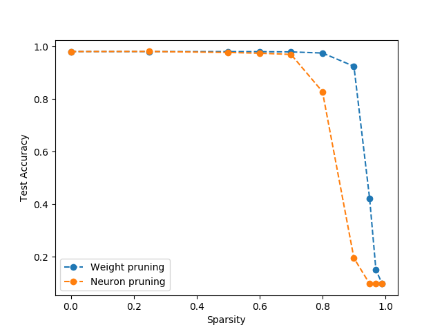
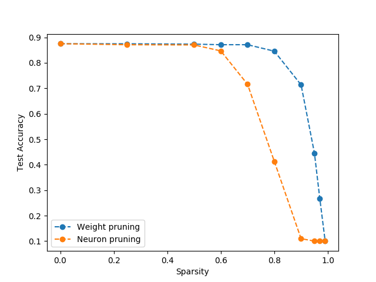

This repository explores the weight and neuron pruning methods for neural networks. It studies the effect of sparsity on the accuracy of trained networks. It works with the MNIST and Fashion-MNIST datasets. The plots and analysis below contain more details.

#### Dependencies used for development

```
matplotlib==3.0.0
numpy==1.15.4
Python==3.5.2
tensorflow-gpu==1.13.1
```

#### Instructions for reproducing results

The script can be run by using the following command:
```
python3 network_pruning.py
```

It will generate plots (sparsity vs accuracy) for the MNIST and Fashion-MNIST datasets in the same folder.

#### Results

The plots generated in one of the runs are as follows (these can vary from run to run).

###### MNIST



###### Fashion-MNIST



#### Analysis

###### What interesting insights did you find?

I found it interesting that the performance with neuron pruning starts deteriorating well before weight pruning. This is not an artifact of the particular run and happens consistently. It is also interesting that for these datasets a sparsity of 50% basically does not affect accuracy.

###### Do the curves differ? Why do you think that is/isn’t?

I think the difference arises from the nature of the computation being done with the two pruning methods. In weight pruning, the activations of neurons might be slightly different but aren't set to zero. In contrast, with neuron pruning a selected portion of the neurons are turned off, which might have adverse effects in subsequent layers where that activation might be important. This might lead to faster deterioration in the case of neuron pruning.

###### Do you have any hypotheses as to why we are able to delete so much of the network without hurting performance?
Some of it might come down to the information needed to make the correct prediction. For example, in the case of MNIST, the relevant information is the outer boundary of the digit. If only a subset of the neurons are responsible for capturing this structure, the rest can be pruned away without adverse effects. Also, in this case, we are not using the translational invariance of CNNs, which might give us a lot of useless weights.
